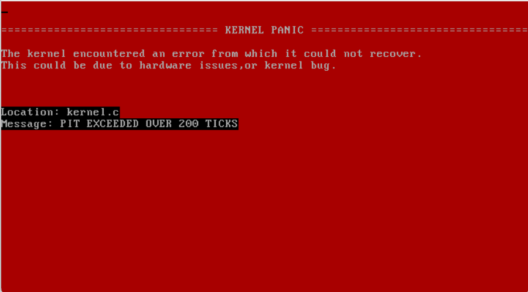

# ArtilleryOS 

ArtilleryOS is a unique graphical operating system that combines the simplicity and power of Unix-like systems with a tiling window management environment. Featuring a custom-designed kernel, ArtilleryOS offers an efficient and user-friendly computing experience.

## Features

- **Unix-Like Environment:** ArtilleryOS provides a Unix-like command-line interface, offering familiar commands and utilities for system management and programming.

- **Tiling Window Management:** Enjoy a productive workflow with a tiling window manager that automatically arranges open applications into non-overlapping tiles, optimizing screen space and workflow efficiency.

- **Custom Kernel:** ArtilleryOS boasts a custom-designed kernel that enhances system performance, security, and resource management, providing a stable foundation for your computing needs.

- **Graphical User Interface (GUI):** Navigate the system effortlessly with an intuitive graphical user interface that combines the power of the command line with a visually appealing desktop environment.

- **Software Ecosystem:** Access a growing ecosystem of software packages and applications to tailor ArtilleryOS to your specific needs.

- **Customization:** Customize your ArtilleryOS experience with themes, keyboard shortcuts, and configuration options to suit your preferences.

- **Security:** Benefit from robust security features to protect your data and system integrity.

## Getting Started

To get started with ArtilleryOS, follow these steps:

1. [Download the latest release](https://github.com/lvntky/ArtilleryOS/releases).
2. Create a bootable USB drive or set up a virtual machine environment for testing.
3. Boot into ArtilleryOS and follow the on-screen instructions for installation.

For detailed installation instructions and troubleshooting, please refer to the [Installation Guide](docs/installation-guide.md).

## Documentation

Explore the [Documentation](docs/) directory to find comprehensive guides and resources for using and customizing ArtilleryOS. Topics include system administration, application development, and customization options.

## Contributing

We welcome contributions from the community to improve and expand ArtilleryOS. To contribute, please follow these steps:

1. Fork the ArtilleryOS repository.
2. Create a new branch for your feature or bug fix.
3. Make your changes and commit them.
4. Push your changes

## Dependencies

- `gcc`: GNU Compiler Collection
- `nasm`: Netwide Assembler
- `make`: For building automatically
- `i686-elf-tools`: For cross-compiling code
- `mtools`: For the use of the `mformat` command
- `xorriso` - To manipulate ISO 9660 filesystems

## Contributors

- [angelpilled](https://github.com/angelpilled)

## Screenshots
We are tracking the progress of Artillery OS with screenshots. You can find more of them in [Documentation](docs/) folder.

* VGA Graphics Screen Demo :

* GUI Bitmap Font Rendering :

* Kernel Panic aka Red Screen of Death :

## License

The Artillery OS and its core components are licensed under the **MIT License**.

The full text of the license can be accessed via [this link](https://opensource.org/licenses/MIT) and is also included in the [license](LICENSE) file of this software package.
